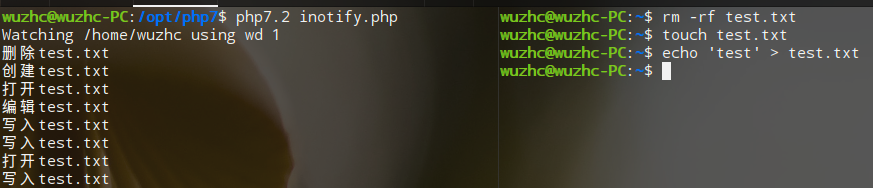

php-inotify用于监控目录或文件事件

### inotify机制
可以参考我的笔记 —— [inotify监控文件事件](https://github.com/wuzhc/zcnote/blob/master/c/inotify.md) 

### 环境
- php7+

### 编译安装
```bash
/path/to/phpize
./configure --with-php-config=/path/to/php-config
make && make install

# 配置php.ini
extension=inotify.so
```

### php脚本
```php
// inotify.php
$eventNameMap = [
  'IN_ATTRIB'        => '编辑',
  'IN_OPEN'          => '打开',
  'IN_WRITE'         => '写入',
  'IN_MODIFY'        => '修改',
  'IN_CREATE'        => '创建',
  'IN_ACCESS'        => '访问',
  'IN_CLOSE_NOWRITE' => '关闭',
  'IN_DELETE'        => '删除',
  'IN_DELETE_SELF'   => '删除',
  'IN_OPEN'          => '打开',
  'IN_MOVED_FROM'    => '移出',
  'IN_MOVED_TO'      => '移入',
  'IN_ISDIR'         => '目录'
];

$inotify = new Inotify();
$inotify->addWatch(['/home/wuzhc']);

while (true) {
  $result = $inotify->run();
  foreach ($result as $event) {
    if (!isset($event['mask'], $event['name'])) {
      continue;
    }
    echo $eventNameMap[$event['mask']] . $event['name'] . "\n";
  }
}
```

### 运行
```bash
/path/to/php inotify.php
```

### 结果


### 说明
```php
$inotify->addWatch(array path);
```
path 监控目录或文件，类型为数组，可以同时监控多个文件或目录

```php
$inotify->run();
```
run运行时会阻塞程序，直到有事件发生会返回数据，然后继续下次监控

